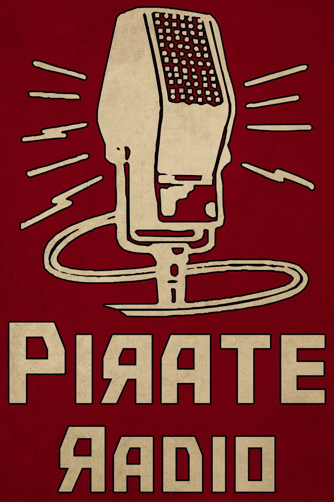

<p align="center">
 
</p>

# Pirate Radio
This is a mod for [Contraband Police](https://store.steampowered.com/app/756800/Contraband_Police/). It allows you to add custom radio channels.

> [!IMPORTANT]
> This mod, "Pirate Radio," is purely a fictional and creative addition to enhance the gaming experience. It is themed around historical pirate radio broadcasts and does not promote, condone, or encourage any form of illegal activity or media piracy. The mod is intended solely for entertainment purposes within the context of the game.

# Install
1. Download [BepInEx 5.4](https://github.com/BepInEx/BepInEx/releases/tag/v5.4.23.2) ([x64](https://github.com/BepInEx/BepInEx/releases/download/v5.4.23.2/BepInEx_win_x64_5.4.23.2.zip) | [x32](https://github.com/BepInEx/BepInEx/releases/download/v5.4.23.2/BepInEx_win_x86_5.4.23.2.zip))
2. Extract the archive into the root directory of Contraband Police
3. Download Pirate Radio ([Releases](https://github.com/Kerillian/PirateRadio/releases))
4. Place `PirateRadio.dll` in `BepInEx/plugins`
5. Done. Now see [Usage](#Usage)

# Usage
After installing the mod and running the game once, a new folder will be created within the root directory of the game called `Channels`. Any subfolder within the `Channels` folder will become a radio channel, and any audio files placed within those subfolders gets added to that channel as a song.

> [!WARNING]
> I have not tested the limits. Adding lots of radio channels will possibly lead to performance loss. Adding lots of audio files _should_ be fine though, but don't quote me on it.

- `<game_root>`
  - Channels
    - Pirate Radio
      - Song1.mp3
      - Song2.mp3
      - Song3.mp3
    - 80s on 8
      - Cool song.wav
      - Even cooler song.flac
    - Freedom Radio
      - Fight the power.mp3
      - etc.xm


### Keybinds
I've also added some keybinds to make the radio more enjoyable to use. They can be configured by opening the config file in `BepInEx/config/kerillian.pirate.radio.cfg`

| Default Key | Description                               |
|-------------|-------------------------------------------|
| F5          | Toggle the radio                          |
| F6          | Skip track on the current channel         |
| F7          | Reload radio channels                     |
| F8          | Open `Channels` folder in a file explorer |


# Supported files
All audio formats Unity supports.

|              Format              |  Extension  |
|:--------------------------------:|:-----------:|
|           MPEG layer 3           | .mp3, .mp2  |
|            Ogg Vorbis            |    .ogg     |
|          Microsoft Wave          |    .wav     |
| Free Lossless Audio Codec (Flac) |    .flac    |
|  Audio Interchange File Format   | .aiff, .aif |
|   Ultimate Soundtracker module   |    .mod     |
|      Impulse Tracker module      |     .it     |
|      Scream Tracker module       |    .s3m     |
|       FastTracker 2 module       |     .xm     |


# Development
Due to requiring libraries from the game, you have to setup a MSBuild property called `ConPolPath` that points to the games install location.
If you don't know how to add a global property I've written a few examples below for different tools.

> [!NOTE]
> Example of a valid path: `C:\Program Files (x86)\Steam\steamapps\common\Contraband Police`
> - The path should be absolute
> - No trailing slashes

### Rider
Settings **>** Build, Execution, Deployment **>** Toolset and Build **>** MSBuild global properties

### Dotnet CLI
Add the argument `-p:ConPolPath="Absolute/Path/Here"`

### Visual Studio
Visual Studio stores editor specific values in `.csproj.user`. So create or edit `PirateRadio.csproj.user` and add the xml tag `ConPolPath`


```xml
<?xml version="1.0" encoding="utf-8"?>
<Project>
  <PropertyGroup>
    <ConPolPath>Absolute/Path/Here</ConPolPath>
  </PropertyGroup>
</Project>
```

# Thanks
- Friends & Family. Love you.
- [BepInEx](https://github.com/BepInEx/BepInEx)
- [Kade](https://github.com/Kade-github)
  - [Their mod](https://github.com/Kade-github/BombRushRadio) for Bomb Rush was a massive help in understanding how to load files from StreamingAssets.